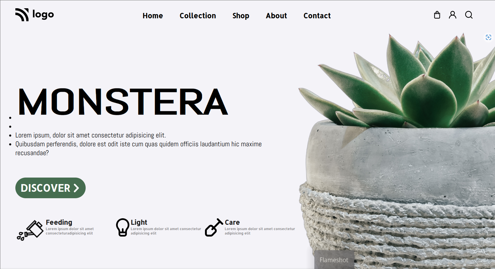

# Monstera-Go-Green

# Monstera Go Green

> Project 6

<table>
<tr>
<td>
  A landing page designed using pure HTML & CSS.
</td>
</tr>
</table>

### Skills Gained from this

- Learned about CSS Positioning, Relative, Absolute. Also `position: fixed;`.

### Screenshot

## Device support

The site is compatible with desktop/laptop screens only.

## Author

